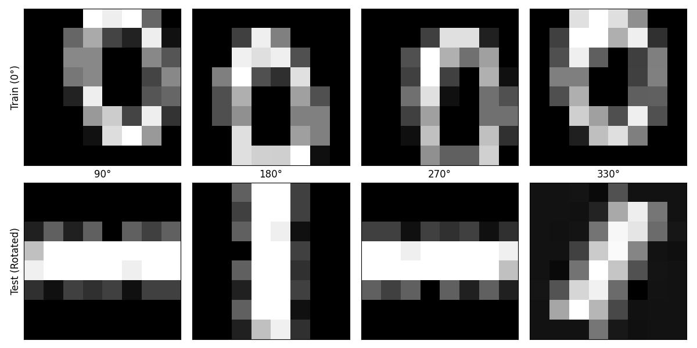
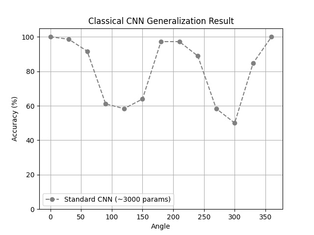
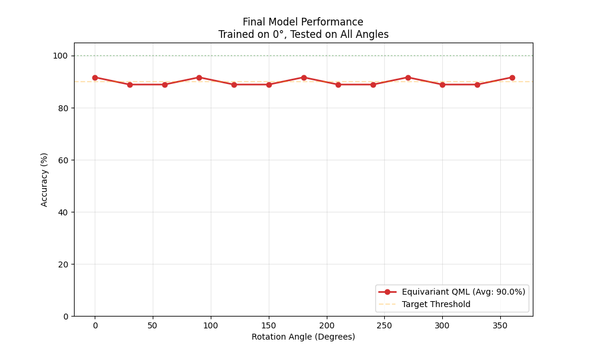

# Rotation-Invariant QCNN: Zero-shot Generalization Demo

[](https://www.python.org/)
[](https://pytorch.org/)
[](https://pennylane.ai/)
[](https://opensource.org/licenses/MIT)

> 📖 **Read the full detailed analysis (in Chinese) on my blog:** [https://cbug2025.github.io/2026/02/13/%E4%BB%8E%E2%80%9C%E6%AD%BB%E8%AE%B0%E7%A1%AC%E8%83%8C%E2%80%9D%E5%88%B0%E2%80%9C%E4%B8%BE%E4%B8%80%E5%8F%8D%E4%B8%89%E2%80%9D%EF%BC%9A%E7%94%A8-PyTorch-PennyLane-%E6%9E%84%E5%BB%BA%E6%97%8B%E8%BD%AC%E7%AD%89%E5%8F%98%E9%87%8F%E5%AD%90%E5%88%86%E7%B1%BB%E5%99%A8/]

## 1. Abstract

In the field of Embodied AI and robotics, recognizing objects in different poses usually requires massive Data Augmentation. Classical CNNs often behave like students who use "rote memorization": they can recognize an upright cup but fail when it's tilted.

This repository implements a **Rotation-Equivariant Quantum Convolutional Neural Network (QCNN)** using **PyTorch** and **PennyLane**. 

**Key Achievement:**
With only **30 parameters**, the QCNN achieves **Zero-shot Generalization** on 360° rotated images while training *only* on 0° images. It outperforms a classical CNN (3000 parameters) which fails to generalize under the same conditions.

## 2. The Experiment: An "Unfair" Fight

We designed a challenge to test geometric understanding versus pattern matching using the **MNIST/Digits dataset (Digits 0 and 1)**.

### The Rules
* **Training Set (The Trap):** Both models only see **0° (upright)** images.
* **Test Set (The Test):** Models must classify images rotated from **0° to 360°**.

| Model | Type | Parameters | Strengths |
| :--- | :--- | :--- | :--- |
| 🔴 **Ours** | **Equivariant QCNN** | **~30** | Physical symmetry, Rotation Equivariant |
| ⚫ **Baseline** | Classical CNN | ~3000 | High capacity, but lacks geometric priors |

<p align="center">
  
  <br>
  <em>Visualization: 0° Training samples vs. Rotated Test samples</em>
</p>

## 3. Architecture

Instead of a brute-force quantum circuit, we use a **4x4 Grid Topology** that respects physical symmetry. The circuit uses **Angle Embedding** and shares parameters between "inner" and "outer" rings to enforce rotation invariance.

<p align="center">
  
</p>

## 4. Results

### Classical CNN: The "W" Shape Failure
Despite having 100x more parameters, the classical CNN fails to generalize. Its accuracy drops significantly at unseen angles (90°, 180°, 270°), indicating it learned pixel patterns rather than geometric shapes.

### QCNN: Stable Zero-shot Generalization
The Quantum model maintains high accuracy across all angles, proving that the circuit structure successfully encoded the **rotation equivariance** property.

| Classical CNN (Baseline) | Quantum Model (Ours) |
| :---: | :---: |
|  |  |
| *High variance on unseen angles* | *Stable accuracy across 360°* |

## 5. Installation

1. Clone the repository:
   ```bash
   git clone [https://github.com/your-username/rotation-invariant-qcnn.git](https://github.com/your-username/rotation-invariant-qcnn.git)
   cd rotation-invariant-qcnn

2. Install dependencies:
    ```bash
    pip install -r requirements.txt

## 6. Usage

*  To reproduce the training and evaluation results:
    ```bash
    python src/main.py
*   Note: Pre-trained weights are available in the `models/` directory.

## 7. References

1. **Cong, I., et al.** "Quantum convolutional neural networks." *Nature Physics* 15, 1273–1278 (2019).
2. **Cohen, T. S., & Welling, M.** "Group equivariant convolutional networks." *ICML* (2016).
3. **PennyLane Documentation.** "Geometric Quantum Machine Learning."

## License

This project is licensed under the MIT License - see the [LICENSE](https://www.google.com/search?q=LICENSE) file for details.
